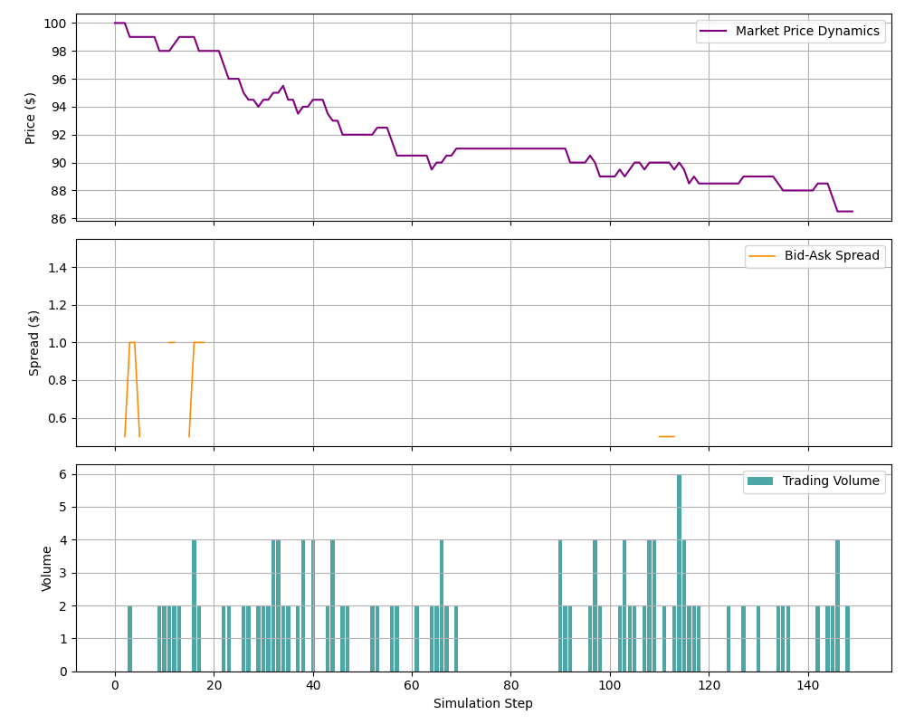
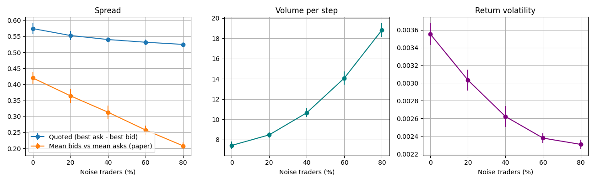

# Heterogeneous Multi-Agent Limit Order Book (LOB) Simulation

An agent-based simulation of a limit order book populated by reinforcement learning traders with different behavioral traits.



## Overview

This project is inspired by Lussange et al. (2024), who study how three trader traits (learning rate, herding, and noise trading) affect market stability using their SYMBA multi-agent reinforcement learning simulator. This is an independent, simplified implementation, not a replication: it uses Q-learning agents and is not calibrated to real market data.

### Agent Archetypes

- **Standard Q-Learning Traders ($\alpha = 0.1, \varepsilon = 0.2$):** Baseline learning agents.
- **High-Alpha Traders ($\alpha = 0.85$):** React strongly to recent outcomes.
- **Herding Traders ($P_{\text{herd}} = 0.75$):** Copy the dominant action of the previous step.
- **Noise Traders:** Submit random orders and do not learn.

## Key Findings

Noise-trader experiment (50 agents, 500 steps, 20 runs per setting), raising the share of noise traders from 0% to 80%:



- **Higher trading volume:** average volume per step rises from 7.4 to 18.8, consistent with the paper.
- **Lower volatility:** return volatility falls from 0.0036 to 0.0023, also consistent with the paper.
- **Narrower spreads:** the quoted bid-ask spread narrows from 0.57 to 0.53, the opposite of the paper's result. A likely cause is that agents here quote within a fixed band around the last price rather than from heterogeneous private valuations.
- **Fewer empty books:** the share of steps where one side of the book has no orders drops from 71% to 9%.

## Getting Started

```bash
pip install -r requirements.txt
python market_environment.py
```

Outputs `behavioral_experiment_results.png` and `noise_trader_experiment.png`, and prints the experiment table.

## References

Lussange J, Vrizzi S, Palminteri S, Gutkin B (2024). Mesoscale effects of trader learning behaviors in financial markets: A multi-agent reinforcement learning study. *PLoS ONE* 19(4): e0301141. https://doi.org/10.1371/journal.pone.0301141

Original simulator (SYMBA, C++): https://github.com/johannlussange/symba